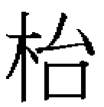
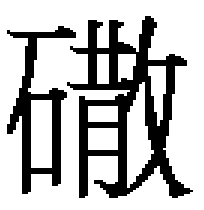
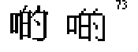
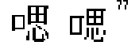
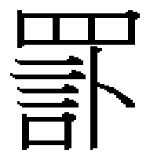
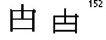
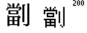

### 國喬中文系統外字集

## 造字檔：

|文件名|點陣尺寸|說明|
|--------|----|---------|
|KCWORD16.F00|16Px|仿宋體(官方名，實為宋體風格)|
|KCWORD16.F15|16Px|仿宋體簡體(官方名，實為宋體風格)|
|KCWORD24.F00|24Px|仿宋體(官方名，實為宋體風格)|
|KCWORD24.F01|24Px|隸書|
|KCWORD24.F02|24Px|楷書|
|KCWORD24.F04|24Px|宋體|
|KCWORD24.F05|24Px|黑體|
|KCWORD24.F15|24Px|仿宋體簡體(官方名，實為宋體風格)|

## 字符：

|國喬序號|字符|字形|Unicode碼|IDS(若需要)|備註|
|--------|----|----|---------|-----------|----|
|6|邨||90A8||
|7|氹||6C39||
|8|乪||4E6A||
|9|冲||51B2||
|10|㘭||362D||向量字為“坳”（Big5重複收錄字）
|11|陁||9641||
|12|担||62C5||
|13|勅||52C5||
|14|壳||58F3||
|15|枱||67B1||
|16|响||54CD||
|17|恒||6052||Big5倚天補充7字之一
|18|叁||53C1||
|19|祢||7962||
|20|祙||889C||
|21|栢||6822||
|22|𪸜||2AE1C||
|23|孭||5B6D||
|24|𤥃||24943||
|25|脇||8107||
|26|脷||8137||
|27|埗||57D7||
|28|烱||70F1||
|29|堃||5803||
|30|啓||5553||
|31|鈎||920E||
|32|着||7740||
|33|琼||743C||
|34|䓪||44EA||
|35|揾||63FE||向量字為“搵”（Big5重複收錄字）
|36|煊||714A||
|37|滙||6ED9||
|38|叠||53E0||向量字為⿱叒宜
|39|献||732E||
|40|裏||88CF||Big5倚天補充7字之一，向量字為⿴衣⿻甲一
|41|碍||788D||
|42|羣||7FA3||
|43|綫||7DAB||
|44|踪||8E2A||
|45|蔴||8534||
|46|𠾐||20F90||
|47|䃟||40DF||
|48|餸||9938||
|49||||⿱𦥯⿱儿土|疑似錯誤字收錄(壆
|50|椚||691A||
|51|鰂||9C02||
|52|鑛||945B||
|53|，||FF0C||
|54|　||3000||
|55|。||3002||
|56|☑||2611||
|57|鱲||9C72||
|58|羗||7F97||
|59|葱||8471||
|60|窰||7AB0||
|61|╩||2569||
|62|╗||2557||
|63|╣||2563||
|64|╝||255D||
|65|═||2550||
|66|║||2551||
|67|捬||636C||
|68|徧||5FA7||
|69|尅||5C05||
|70|疱||75B1||
|71|聇||8047||Big5重複收錄字
|72|麻||9EBB||為了與16Px及向量字做出林𣏟區別
|73|啲||5572||
|74|峯||5CEF||
|75|啫||556B||
|76|㦸||39B8||
|77||||⿰口思|
|78|煑||7151||
|79|菓||83D3||
|80|㗎||35CE||
|81|啱||5571||
|82|喺||55BA||
|83|賍||8CCD||
|84|嗱||55F1||
|85|韮||97EE||
|86|煱||7171||
|87|㗒||35D2||
|88|嗰||55F0||
|89|樋||6A0B||
|90|塲||5872||
|91|婣||5A63||
|92|罸||7F78||
|93|𡻕||21ED5||
|94|慯||616F||
|95|榘||6998||
|96||||⿱罒⿰言卜|
|97|綉||7D89||
|98|粮||7CAE||
|99|嘅||5605||
|100|嘢||5622||
|101|嘭||562D||
|102|橺||6A7A||
|103|綳||7DB3||
|104|噃||5643||
|105|澁||6F81||
|106|髴||9AF4||
|107|噻||567B||
|108|嫺||5AFA||Big5倚天補充7字之一
|109|墻||58BB||Big5倚天補充7字之一
|110|牕||7255||
|111|嘞||561E||
|112|癎||764E||
|113||||⿰衤⿳田土⿱儿夂|疑似錯誤字收錄(禝
|114|嚒||5692||
|115|輭||8F2D||
|116|銹||92B9||Big5倚天補充7字之一
|117|鵞||9D5E||
|118|麯||9EAF||
|119|瞹||77B9||
|120|罇||7F47||
|121|糍||7CCD||
|122|鷄||9DC4||
|123|贘||8D18||
|124|决||51B3||
|125|攰||6530||
|126|虬||866C||
|127|咤||54A4||
|128|涖||6D96||
|129|厦||53A6||
|130|刦||5226||
|131|吚||541A||
|132|朶||6736||
|133|両||4E21||
|134|却||5374||
|135|廹||5EF9||
|136|効||52B9||
|137|咏||548F||
|138|廸||5EF8||
|139|妬||59AC||
|140|怱||6031||
|141|牀||7240||
|142|嘷||5637||
|143|吓||5413||
|144|朥||6725||
|145|樫||6A2B||
|146|咗||5497||
|147|脗||8117||向量字為⿰月忽
|148|瘻||763B||
|149|絝||7D5D||
|150|遡||9061||
|151|曱||66F1||
|152|甴||7534||
|153|亘||4E98||
|154|弍||5F0D||
|155|粦||7CA6||
|156|晋||664B||
|157|笹||7B39||
|158|寗||5BD7|⿳宀必𭁠|疑似錯誤字收錄(接近寗），點陣字錯誤繪製
|159|曁||66C1||
|160|奵||5975||
|161|㛇||36C7||
|162|慤||6164||
|163|呍||544D||
|164|嘛||561B||為了與16Px及向量字做出林𣏟區別
|165|嚤||56A4||
|166|嚟||569F||
|167|擓||64D3||
|168|挮||632E||
|169|捏||634F||原編碼作揑
|170|揸||63F8||
|171|攞||651E||
|172|灿||707F||
|173|烟||70DF||
|174|𤎌||2438C||
|175|洤||6D24||
|176|溋||6E8B||
|177|粧||7CA7||Big5倚天補充7字之一
|178|糉||7CC9||
|179|叙||53D9||
|180|敍||654D||
|181|坂||5742||
|182|珏||73CF||
|183|辻||8FBB||
|184|胆||80C6||
|185|乸||4E78||
|186|厨||53A8||向量字為“㕑”
|187|欵||6B35||
|188|𥕛||2555B||
|189|𩶘||29D98||
|190|靝||975D||
|191|厠||53A0||
|192|猄||7304||
|193|携||643A||向量字為“㩗”
|194|衞||885E||
|195|瞓||7793||
|196|𧝁||27741||
|197|耻||803B||
|198|𦉘||26258||向量字為“罉”
|199|𧩙||27A59||
|200|劏||528F||
|201|||||輸入法用(母外框
|202|龱||2612||輸入法用
|203|䒑||4491||輸入法用
|204|﹅||FE45||輸入法用
|205|𧘇||27607||輸入法用
|206|||||輸入法用(𫜹首筆及末筆
|207|乚||4E5A||輸入法用
|208|辶||8FB6||輸入法用
|209|𠃌||200CC||輸入法用
|210|丿||4E3F||輸入法用
|211|乛||4E5B||輸入法用

Luke036

2025年8月10日 整理

2025年9月1日 新增向量字圖、改正編碼

作為點陣字體歷史檔案館之資料
